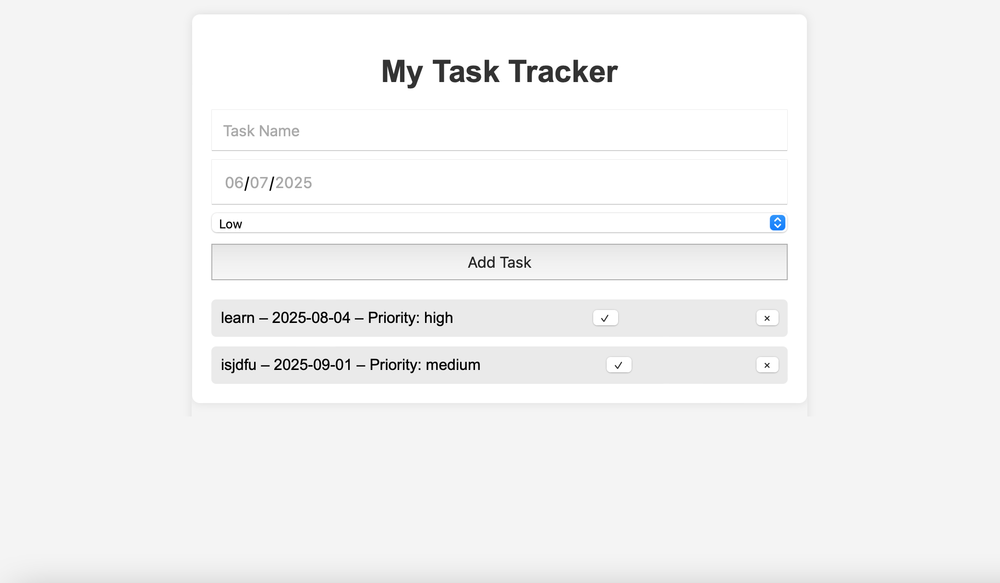

# Task Tracker Web App

A simple task-tracking application built with HTML, CSS, and JavaScript. Users can add tasks with deadlines and priorities, mark them as complete, or delete them.

## 💻 Features
- Add new tasks with name, date, and priority
- Mark tasks as completed
- Delete tasks
- Clean and responsive layout

## 📁 Project Structure

## 🛠️ Technologies Used
- HTML5
- CSS3
- JavaScript (Vanilla)

## 📌 Future Improvements
- Add task persistence using LocalStorage
- Filter tasks by priority or completion
- Add edit functionality

## 📷 Preview

## 📄 License
MIT – feel free to use and modify.
